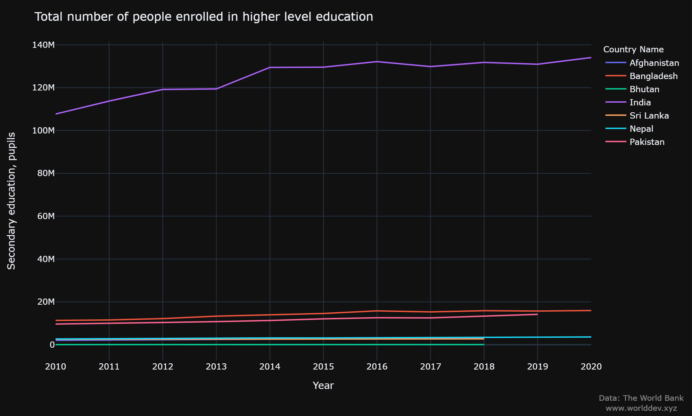
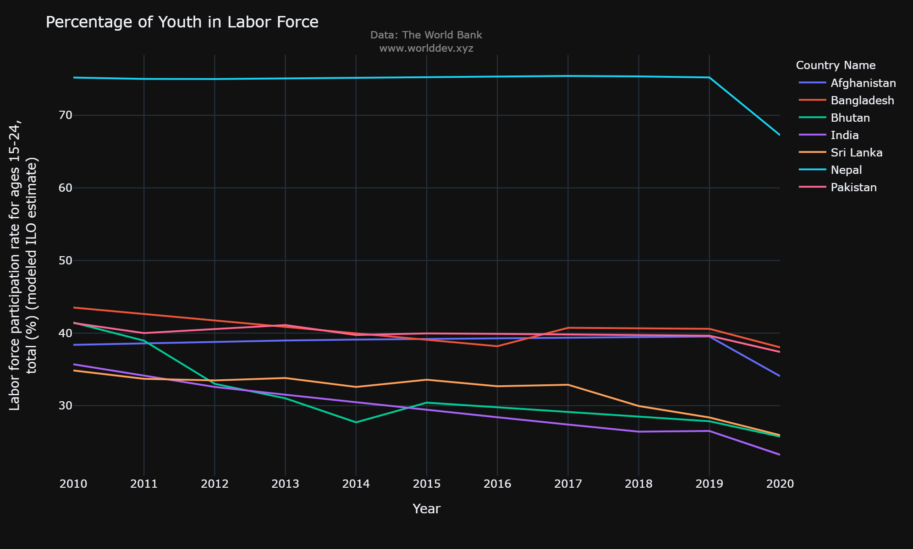
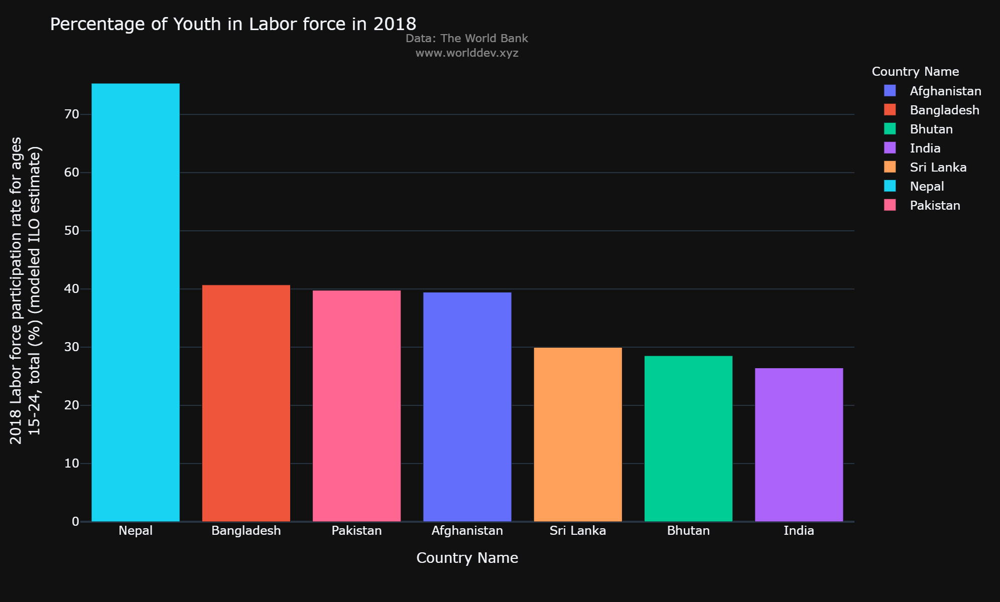
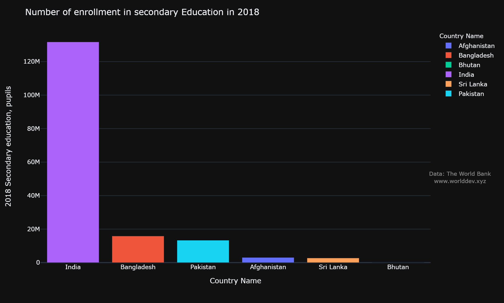

# Does education have impact on labour force participation on youth?
*Name: Laxmi Yadav*

*University Of Maryland Baltimore County*

## Introduction

Youth employment participation has been declining for a while now all around the world. When we look at the topic broadly, it may seem as though the world is changing very quickly—tech companies are taking over our daily lives, cultures all over the world are modernizing, etc.—but when we look more closely, we find that there are fewer youth in the workforce than there were in the 2010. It's really stunning, huh? Let's look at what kind of an influence "enrollment in higher-level education" has on the percentage of youth who are in the workforce now that we've dug a little deeper.

## Topics & Indicators
**Secondary education, pupils:** The total number of students enrolled in secondary education in both public and private institutions.

**Labor force participation rate for ages 15-24, total (%) (modeled ILO estimate):** The percentage of the population aged 15 to 24 who are economically active—all those who provide labor for the creation of goods and services over a given time period—is known as the labor force participation rate for this age group.

## Countries under observation
We will consider South Asian countries for our observation:
1. India
2. Pakistan
3. Afganistan
4. Nepal
5. Bhutan
6. Srilanka
7. Bangladesh

## What connection exists between higher education enrolment and labor force participation?
Prior to examining a comparison between the two, let's first take a closer look at youth involvement in the labor force and higher education separately.

### Total number of people enrolled in higher level education:

The graph above led to the observations that are listed below:
1. We can observe that, India having the large populations, has the highest enrollment of the people for higher level education over the period of the time i.e over 100 millions.
2. Bangladesh and pakistan's enrollment for secondary education has slighty increasing over the period of 2012 to 2016.
3. Nepal, Bhutan and Afganistan follows Srilanka being the consistant with the enrolled of the people over the period of time.
4. One thing common between all the countries except India, is the the population of other South Asian countries is lesses than 20M and for most of the countries the trend is consistent.

### Percentage of Youth in Labor Force

Following are some observation of the above time series graph:
1. From the above time series we can see that the percentage of youth for the age 15-24 experience the downtrend in the year 2019-2022 due to the covid.
2. It can be clearly seen that Nepal stands out from all the other countries with youth labor-force participation of close to 80%.
3. The participations of Indian youths in the Labor forces seems to be decreasing over the year form 35% to 15% from year 2010-2019. In 2020 it decreases more to 23%.
4. Bhutan and Afganistan follows similar trend India being at the bottom.
5. We can see that the trends in the countries' "Total of people enrolled in Secondary education" and "Percentage of youth in the labor force" are somewhat comparable. 

To help the inference, let's examine this resemblance in more detail using a scatter plot.

### Comparison between "Percentage of Youth in Labor Force" VS "Total number of people enrolled in higher level education"

Below are the observation from above graph
1. From above graph, we can clearly see the higher the number of people enrolled in the secondary education, lesser the percentage of youth in labor force
2. Nepal, Bhutan, Sri Lanka and Bangladesh are followed by Pakistan and Afganistan in the scatterplot and we can see that this follows the same trend as seen in the above two graphs.

### Comparing the above two indicator for the year 2010

